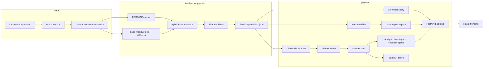
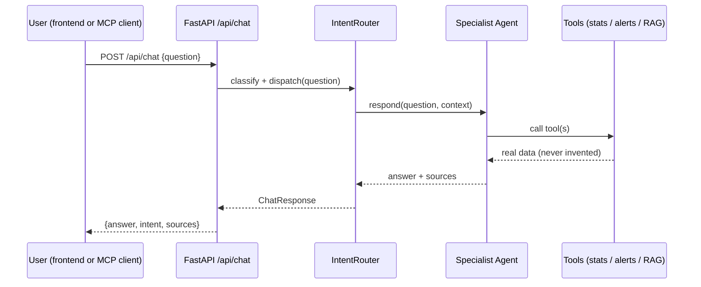

# Architecture

## System diagram

## Request flow — investigation chat

## Design pattern catalog

| Pattern | Where | Why |
|---|---|---|
| **Strategy** | `AnomalyDetector` base + `DBSCANDetector`/`SupervisedDetector` | Swap or add detectors without touching the fusion logic. |
| **Facade** | `HybridFraudDetector` | One simple `.fit()`/`.score()` API hides two different ML models underneath. |
| **Adapter** | `LLMProvider` + `OpenAICompatibleProvider`/`TemplateNarrativeProvider` | Narrative generation doesn't care which LLM (or none) is behind it. |
| **Builder** | `ReportBuilder` | Reports are assembled from independent optional pieces (stats, patterns, narratives) step by step. |
| **Repository** | `AlertRepository`, `ReportRepository`, `NarrativeRepository` | Only one place in the codebase touches the JSON files on disk. |
| **Singleton** | `ChromaStore` | One persistent Chroma client per process; avoids re-opening the on-disk index. |
| **Router + Factory** | `IntentRouter` | Classifies a question then constructs/dispatches the right specialist agent — new intents plug in without touching existing agents. |

## Why hybrid instead of DBSCAN-only

The reference project (DBSCAN-only) has no calibrated probability and depends entirely on `eps`/
`min_samples` tuning: too strict and it misses fraud, too loose and everything looks like noise. Adding
a supervised classifier trained on the (limited) labeled fraud examples gives a calibrated probability
that anchors the DBSCAN signal, so the fused score degrades gracefully instead of swinging on one
hyperparameter.

## Anti-hallucination guarantee (chat)

Every specialist agent's `.respond()` is required to call at least one grounded tool and build its
answer only from that tool's return value. There is no code path where an agent formats a number it did
not receive from `platform/mcp_server/tools/*`. This is what makes the chat safe to demo live: any answer can
be traced back to a concrete function call and its output.
